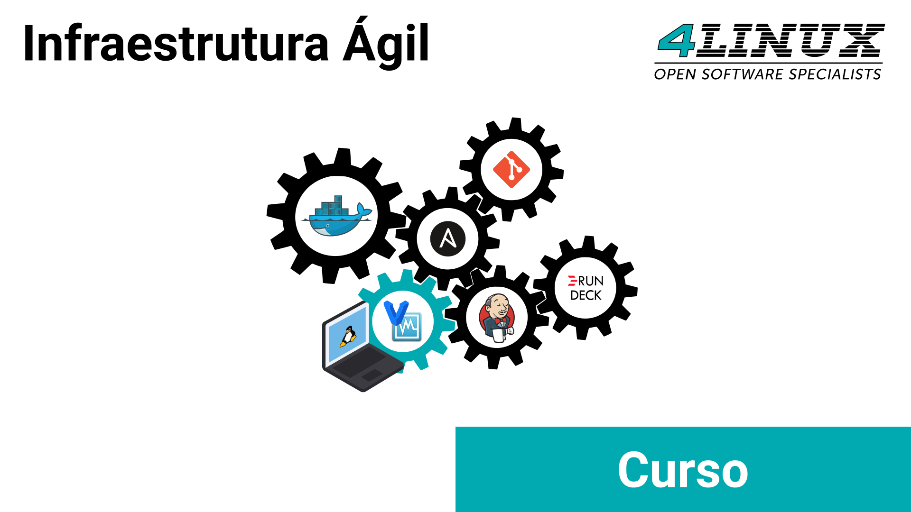

# Infraestrutura Ágil

Este repositório é o ambiente do curso de Infraestrutura Ágil da [4Linux](https://4linux.com.br/).

Ao executar os passos de configuração, sua máquina, através do **Vagrant**, criará as máquinas virtuais no **VirtualBox** de forma automática, com todos os softwares que utilizaremos durante o curso. O **Vagrant** nos auxiliará a criar e gerenciar as máquinas de uma maneira muito mais simples e rápida do que se precisássemos instalá-las manualmente.
